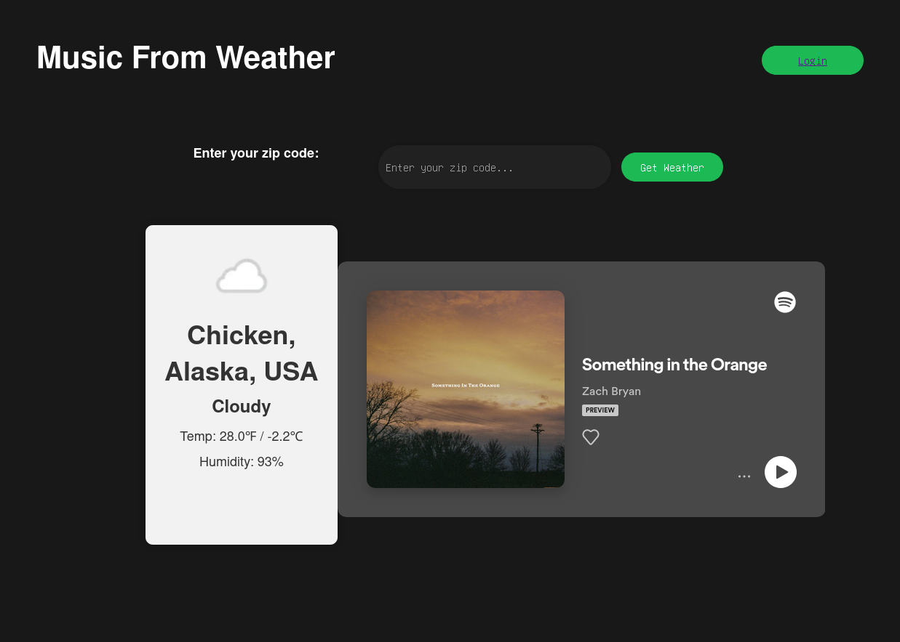
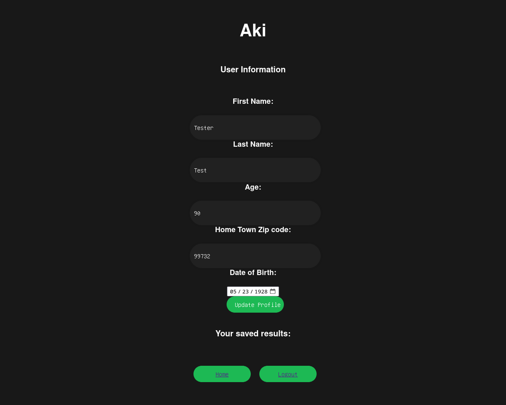

# CS411

CS411 group project

## Usage

Input your zipcode to get a Spotify song recommmendation based on the current weather at your location. You can login via Google to get your generated results saved to your profile. Additionally, you can customize your profile to save your name, zipcode and DOB.

## Screenshots





## Running the project

```
cd Protoype
python manage.py runserver
```

You can access the front page now. The app won't work without API keys, but you can watch the video demo to see how it works.

## Video Demo

You can find the video demo `2023-05-05 11-34-07.mkv` under the `Docs`directory.
